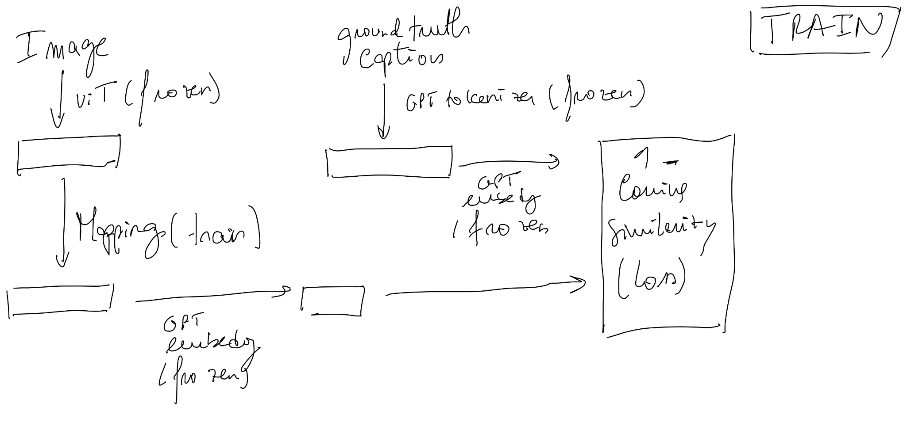
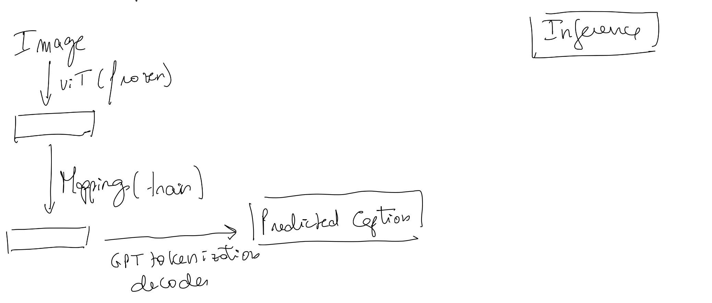
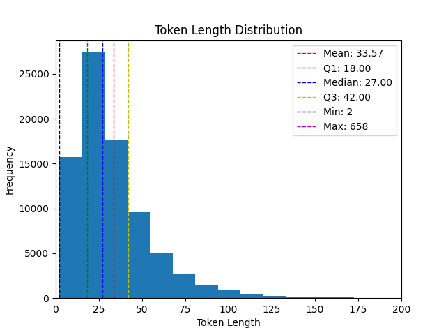

**CapMed**

Uses a ViT image encoder, simple mapping network and medGPT language decoder. It only trains the mapping network. 

- Uses cosine similarity in loss because it allows to see if the captions generated have the same semantic meaning, not exactly the same words. 
- Uses padding to ensure the generated captions and the ground truth have the same length. 
- The mapping network gets as input only the CLS token, not the other patches. 
- The first version do not use non radiology images. 
- Use as text generation and tokenizer "Sharathhebbar24/chat_gpt2_dpo"
- Use gpt2 as text embeding to compare semantic meaning of generated and truth caption with cossine similarity!
- To test the model it is used BLUE and METEOR metrics

 To be executed in slurm we need:
 - create a conda environment capmed 
 - install requirements.txt
 - Execute dataloader.py
 - Execute train.py

For now it was used 175 tokens padding!
**V1**